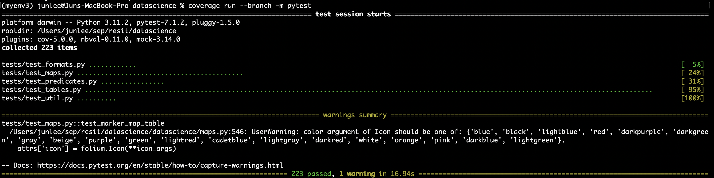
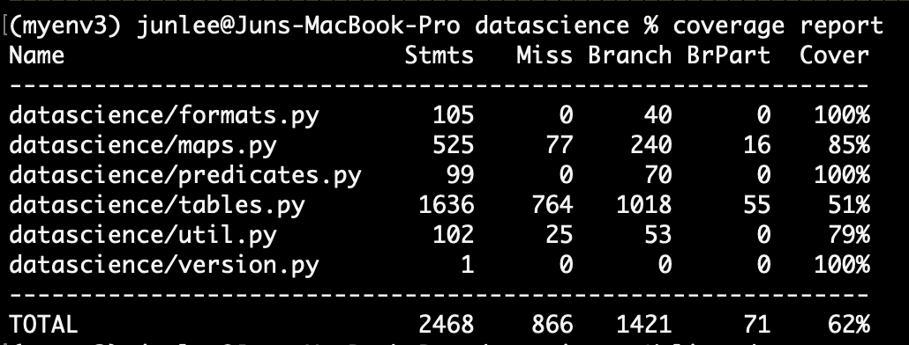
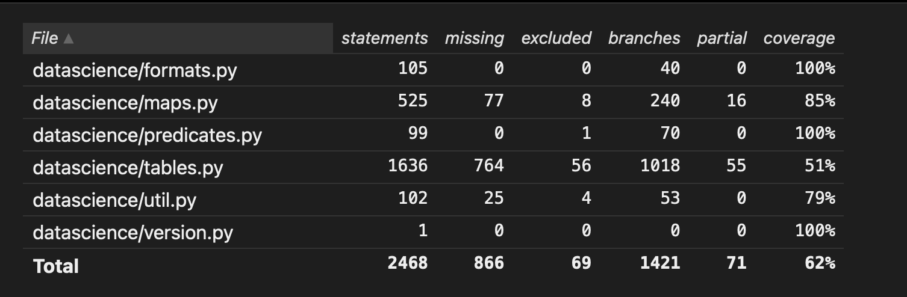
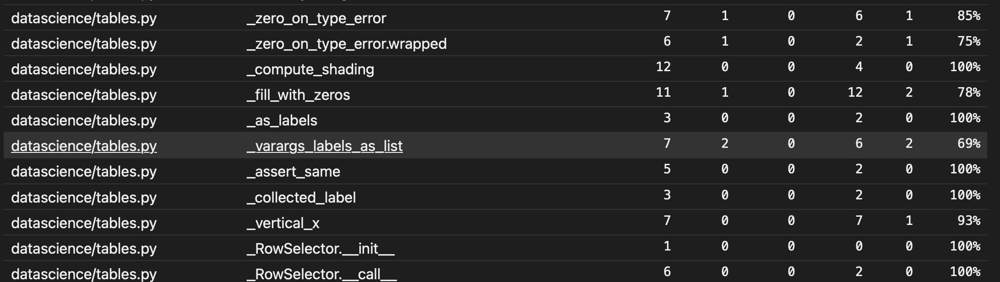
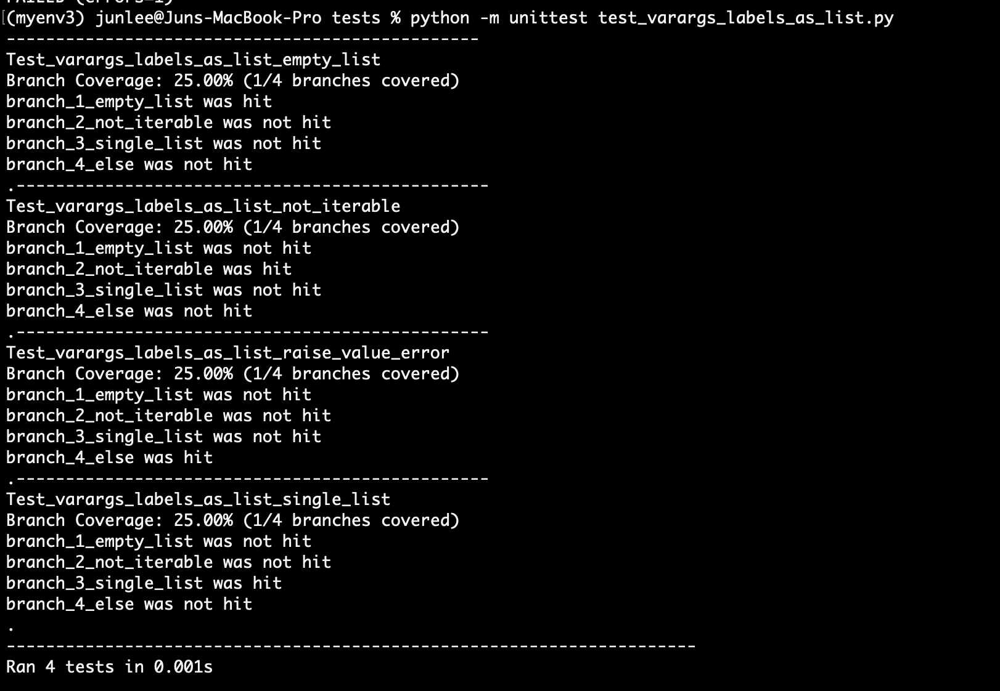
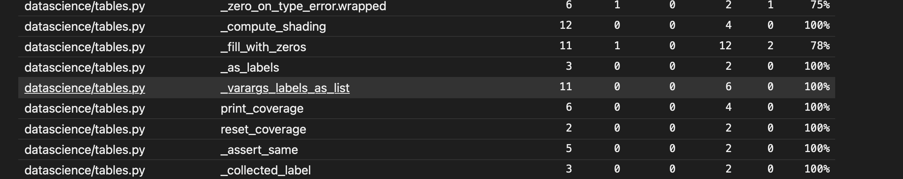
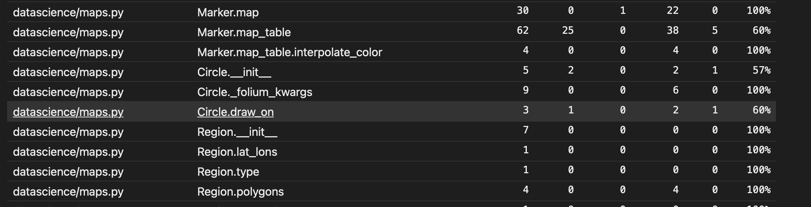
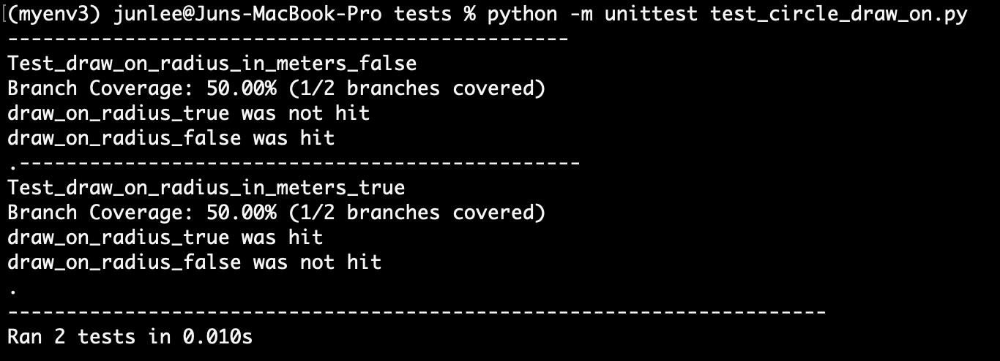
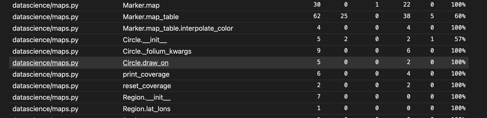
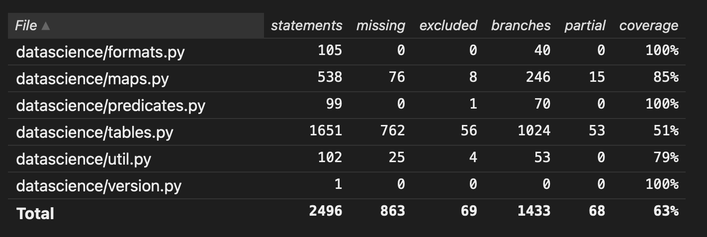

# Report for Assignment 1 resit

## Project chosen

**Name:** Junhyeok Lee

**URL:** https://github.com/data-8/datascience

**Number of lines of code and the tool used to count it:** 5.8 KLOC counted by Lizard.py

**Programming language:** Python

## Coverage measurement with existing tool  

I have used **Coverage.py**, which is an existing tool to measure coverage for python projects. 

**Step 1: clone git project to the local repository**

**Step 2: make sure to install all neccessary modules for projects to run flawlessly**   

**pip install coverage**  
**pip install pytest**  
**pip install datascience**  
**pip install -r requirements.txt**  
**pip install -r requirements-tests.txt**  

**Step 3: Once all modules are installed, change current directory to the root directory of the project and run coverage by Coverage.py**    

**coverage run --branch -m pytest**    

  

**coverage report**  

  

**coverage html**  

  

## Coverage improvement

### Individual tests  

**<Function 1: _varargs_labels_as_list>**

<Show a patch (diff) or a link to a commit made in your forked repository that shows the new/enhanced tests for function 1>  

**Creation of test cases commit:** https://github.com/vu-Jun/datascience/commit/52a880444d99e3a2b3866a85a4e38839d2fc1a0d  

**Creation of instrumentation and flags:** https://github.com/vu-Jun/datascience/commit/bf9c76c05963e64fc2eab859c47eaf382565055b  ,
                                           https://github.com/vu-Jun/datascience/commit/8db13fa1e89a55be4da803eba829b3326985fb54  

**Existing tool old coverage result:**

  

**Instrumented result after creating test cases:**  

**Existing tool new coverage result:**  

<"State the coverage improvement with a number and elaborate on why the coverage is improved">  

**<Function 2: circle.draw_on>**

<Show a patch (diff) or a link to a commit made in your forked repository that shows the new/enhanced tests for function 2>

**Creation of test cases commit:** https://github.com/vu-Jun/datascience/commit/3fde7df62976973049ef9c8b1c57597543d6f48d  

**Creation of instrumentation and flags:** https://github.com/vu-Jun/datascience/commit/07db19f7480d2eefc21240d7c8e9510a10094105  

**Existing tool old coverage result :**  

  

**Instrumented result after creating test cases:**  

**Existing tool new coverage result:**  

<"State the coverage improvement with a number and elaborate on why the coverage is improved">

### Overall

**Before create/enhance test cases:**

**After create/enhance test cases:**

